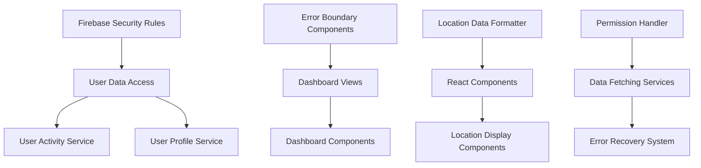

# Firebase Permissions & React Rendering Bug Fix Design

## Overview

This design document outlines the technical solution for resolving critical Firebase permission errors and React rendering issues that prevent users from accessing dashboard functionality. The solution focuses on updating Firebase security rules, implementing proper error handling, and fixing React component rendering logic to handle location objects correctly.

## Architecture

### System Components



### Data Flow Architecture

1. **Permission Flow**: User authentication → Firebase rules validation → Data access granted/denied → Error handling
2. **Location Rendering Flow**: Location data → Format validation → Object-to-string conversion → React rendering
3. **Error Recovery Flow**: Error detection → User-friendly message → Retry mechanism → Fallback content

## Components and Interfaces

### 1. Enhanced Firebase Security Rules

**Location**: `firestore.rules`

**Rule Structure**:
```javascript
rules_version = '2';
service cloud.firestore {
  match /databases/{database}/documents {
    // User profile access rules
    match /users/{userId} {
      allow read, write: if request.auth != null && request.auth.uid == userId;
    }
    
    // User activity access rules
    match /userActivity/{userId} {
      allow read, write: if request.auth != null && request.auth.uid == userId;
    }
    
    // Application data access rules
    match /applications/{applicationId} {
      allow read: if request.auth != null && 
        (request.auth.uid == resource.data.candidateId || 
         request.auth.uid in resource.data.companyUsers);
    }
  }
}
```

### 2. Error Boundary Component

**Component**: `ErrorBoundary.tsx`

**Interface**:
```typescript
interface ErrorBoundaryProps {
  children: React.ReactNode;
  fallback?: React.ComponentType<{error: Error; retry: () => void}>;
  onError?: (error: Error, errorInfo: ErrorInfo) => void;
}

interface ErrorBoundaryState {
  hasError: boolean;
  error?: Error;
  retryCount: number;
}
```

### 3. Location Data Formatter

**Service**: `LocationFormatter.ts`

**Interface**:
```typescript
interface LocationFormatter {
  formatLocation(location: LocationData): string;
  isLocationObject(data: any): boolean;
  extractCoordinates(location: LocationData): {lat: number, lng: number} | null;
}

type LocationData = string | {latitude: number, longitude: number} | {lat: number, lng: number};
```

### 4. Enhanced Data Fetching Services

**Service**: `UserDataService.ts`

**Interface**:
```typescript
interface UserDataService {
  fetchUserActivity(userId: string): Promise<UserActivity[]>;
  fetchUserProfile(userId: string): Promise<UserProfile>;
  handlePermissionError(error: FirebaseError): Promise<void>;
  retryWithBackoff<T>(operation: () => Promise<T>, maxRetries: number): Promise<T>;
}

interface PermissionErrorHandler {
  isPermissionError(error: Error): boolean;
  getErrorMessage(error: FirebaseError): string;
  suggestRecoveryAction(error: FirebaseError): string;
}
```

## Data Models

### Enhanced Error State Model

```typescript
interface ErrorState {
  type: 'permission' | 'network' | 'rendering' | 'unknown';
  message: string;
  userMessage: string;
  recoveryAction?: string;
  retryable: boolean;
  timestamp: Date;
}
```

### Location Data Model

```typescript
interface LocationData {
  formatted?: string;
  coordinates?: {
    latitude: number;
    longitude: number;
  };
  address?: string;
  city?: string;
  country?: string;
}
```

### User Data Access Model

```typescript
interface UserDataAccess {
  userId: string;
  permissions: {
    profile: boolean;
    activity: boolean;
    applications: boolean;
  };
  lastAccessed: Date;
  errorCount: number;
}
```

## Correctness Properties

*A property is a characteristic or behavior that should hold true across all valid executions of a system-essentially, a formal statement about what the system should do. Properties serve as the bridge between human-readable specifications and machine-verifiable correctness guarantees.*

<function_calls>
<invoke name="prework">
<parameter name="featureName">bug-fix-firebase-permissions

### Property 1: Authenticated User Data Access
*For any* authenticated user, accessing their own activity and profile data should succeed without permission errors
**Validates: Requirements 1.1, 1.2, 1.5**

### Property 2: Permission Error Handling
*For any* Firebase permission error, the dashboard should display user-friendly error messages instead of console errors
**Validates: Requirements 1.3, 3.1**

### Property 3: Location Object Rendering
*For any* location data containing coordinate objects, the React renderer should convert them to displayable text format without crashing
**Validates: Requirements 2.1, 2.3**

### Property 4: Location Format Flexibility
*For any* location information in string or object format, the dashboard should handle both gracefully and render appropriately
**Validates: Requirements 2.2, 2.4**

### Property 5: Rendering Error Isolation
*For any* rendering error, the React renderer should prevent application crashes and maintain navigation functionality
**Validates: Requirements 2.5, 3.3, 3.5**

### Property 6: Data Fetching Recovery
*For any* data fetching failure, the dashboard should provide retry mechanisms and maintain user access to working sections
**Validates: Requirements 3.2, 3.5**

### Property 7: Error Logging Completeness
*For any* system error, sufficient debugging information should be captured for developer analysis
**Validates: Requirements 3.4**

## Error Handling

### Firebase Permission Error Scenarios
1. **Unauthenticated Access**: Redirect to login with clear messaging
2. **Insufficient Permissions**: Display specific permission requirements and contact information
3. **Token Expiration**: Automatic token refresh with user notification
4. **Rule Validation Failure**: Graceful fallback with retry mechanism

### React Rendering Error Scenarios
1. **Location Object Rendering**: Convert objects to strings before rendering
2. **Missing Location Data**: Display "Location not specified" fallback
3. **Invalid Coordinate Format**: Show generic location text or hide location section
4. **Component Crash**: Error boundary catches and displays fallback UI

### Data Fetching Error Scenarios
1. **Network Connectivity**: Offline mode with cached data display
2. **Service Unavailable**: Retry with exponential backoff
3. **Data Corruption**: Validate data before rendering and show error state
4. **Timeout Errors**: Cancel requests and provide manual retry option

## Testing Strategy

### Unit Testing Approach
- **Firebase Rules**: Test rule validation with various user scenarios
- **Location Formatter**: Test object-to-string conversion with edge cases
- **Error Boundaries**: Test error catching and fallback rendering
- **Data Services**: Test permission error handling and retry logic

### Property-Based Testing Requirements
- Use **Jest** and **React Testing Library** for component testing
- Use **Firebase Emulator** for security rule testing
- Configure property-based tests to run minimum 100 iterations
- Each property-based test must reference the corresponding design document property
- Tag format: `**Bug Fix Firebase Permissions, Property {number}: {property_text}**`

### Integration Testing
- **End-to-End Permission Flow**: Test complete user authentication to data access
- **Error Recovery Flow**: Test error scenarios and recovery mechanisms
- **Location Rendering Integration**: Test location display across different components
- **Cross-Component Error Isolation**: Verify errors in one component don't affect others

### Security Testing
- **Firebase Rules Validation**: Test unauthorized access attempts
- **Authentication State Management**: Test token expiration and refresh
- **Data Access Boundaries**: Verify users can only access their own data
- **Error Information Leakage**: Ensure error messages don't expose sensitive data

## Implementation Notes

### Technology Stack
- **Frontend**: React 18+ with TypeScript, Next.js App Router
- **Backend**: Firebase Firestore with updated security rules
- **Error Handling**: React Error Boundaries with custom fallback components
- **Testing**: Jest, React Testing Library, Firebase Emulator Suite

### Performance Considerations
- **Error Boundary Optimization**: Minimize re-renders during error states
- **Location Formatting**: Cache formatted location strings to avoid repeated processing
- **Permission Checking**: Implement client-side permission caching
- **Retry Logic**: Use exponential backoff to prevent server overload

### Security Considerations
- **Firebase Rules**: Implement principle of least privilege
- **Error Messages**: Avoid exposing internal system details
- **Authentication**: Validate tokens on both client and server
- **Data Sanitization**: Sanitize all user data before storage and display

### Deployment Strategy
- **Firebase Rules Deployment**: Use Firebase CLI with staging environment testing
- **Component Updates**: Deploy error boundaries first, then updated components
- **Monitoring**: Implement error tracking for permission and rendering issues
- **Rollback Plan**: Maintain ability to revert Firebase rules and component changes