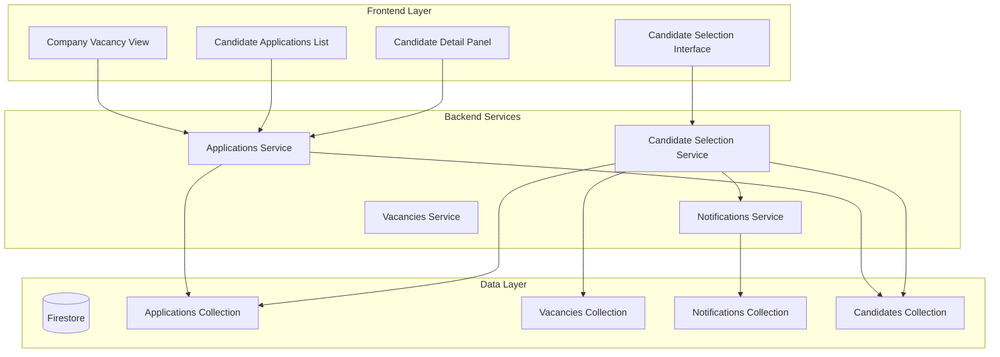

# Design Document

## Overview

The Candidate Selection System extends the existing job application platform to provide companies with comprehensive tools for managing applications, reviewing candidates, and making hiring decisions. The system integrates with the existing Firestore-based architecture and leverages the current notification infrastructure to provide automated candidate communication.

The design follows a service-oriented architecture pattern consistent with the existing NestJS backend, utilizing Firebase Firestore for data persistence and the established notification system for candidate communication.

## Architecture

The system extends the existing three-tier architecture:



## Components and Interfaces

### 1. Candidate Selection Service

**Purpose**: Core business logic for candidate selection and application management

**Key Methods**:
- `getApplicationsForVacancy(vacancyId: string, companyId: string)`: Retrieve all applications for a specific vacancy
- `getCandidateDetails(applicationId: string, companyId: string)`: Get detailed candidate information
- `selectCandidate(applicationId: string, companyId: string, selectedBy: string)`: Mark candidate as selected
- `getSelectionStatus(vacancyId: string)`: Check if vacancy has a selected candidate

**Interface**:
```typescript
interface CandidateSelectionService {
  getApplicationsForVacancy(vacancyId: string, companyId: string): Promise<Application[]>;
  getCandidateDetails(applicationId: string, companyId: string): Promise<CandidateDetails>;
  selectCandidate(applicationId: string, companyId: string, selectedBy: string): Promise<SelectionResult>;
  getSelectionStatus(vacancyId: string): Promise<SelectionStatus>;
}
```

### 2. Application Management Controller

**Purpose**: HTTP endpoints for company application management

**Endpoints**:
- `GET /applications/vacancy/:vacancyId` - List applications for vacancy
- `GET /applications/:applicationId/candidate` - Get candidate details
- `POST /applications/:applicationId/select` - Select candidate
- `GET /vacancies/:vacancyId/selection-status` - Check selection status

### 3. Frontend Components

**CompanyVacancyApplications**: Main component for viewing applications
**CandidateDetailModal**: Modal for detailed candidate review
**CandidateSelectionButton**: Action component for candidate selection
**ApplicationsList**: List component with sorting and filtering

## Data Models

### Application Document (Extended)
```typescript
interface Application {
  id: string;
  uid: string; // candidate ID
  vacancyId: string;
  status: 'pending' | 'selected' | 'rejected';
  createdAt: Timestamp;
  selectedAt?: Timestamp;
  selectedBy?: string; // company representative ID
  notificationSent?: boolean;
  notificationSentAt?: Timestamp;
}
```

### Vacancy Document (Extended)
```typescript
interface Vacancy {
  // existing fields...
  hasSelectedCandidate?: boolean;
  selectedCandidateId?: string;
  selectionDate?: Timestamp;
}
```

### Candidate Details View Model
```typescript
interface CandidateDetails {
  id: string;
  applicationId: string;
  name: string;
  email: string;
  phone?: string;
  experience: string[];
  skills: string[];
  location?: {
    latitude: number;
    longitude: number;
  };
  profileCompleted: boolean;
  applicationDate: Timestamp;
}
```

### Selection Notification Data
```typescript
interface SelectionNotification {
  candidateEmail: string;
  vacancyTitle: string;
  companyName: string;
  positionDetails: string;
  nextSteps: string;
  contactInfo: string;
}
```

## Correctness Properties

*A property is a characteristic or behavior that should hold true across all valid executions of a system-essentially, a formal statement about what the system should do. Properties serve as the bridge between human-readable specifications and machine-verifiable correctness guarantees.*

### Property 1: Complete application retrieval
*For any* vacancy with applications, querying applications for that vacancy should return all applications that exist for that vacancy in the system
**Validates: Requirements 1.1**

### Property 2: Application data completeness
*For any* application returned by the system, it should contain candidate name, application date, and key profile information fields
**Validates: Requirements 1.2**

### Property 3: Application date ordering
*For any* set of applications for a vacancy, they should be returned sorted by application date with most recent first
**Validates: Requirements 1.4**

### Property 4: Vacancy-specific filtering
*For any* vacancy ID, querying applications should return only applications for that specific vacancy and no others
**Validates: Requirements 1.5**

### Property 5: Candidate details completeness
*For any* valid application ID, retrieving candidate details should return complete profile information including all required fields
**Validates: Requirements 2.1**

### Property 6: Required candidate fields presence
*For any* candidate details response, it should contain resume, skills, experience, and contact information fields
**Validates: Requirements 2.2**

### Property 7: Missing information indication
*For any* candidate profile with incomplete data, the system should clearly indicate which information is missing
**Validates: Requirements 2.3**

### Property 8: Selection status update
*For any* candidate selection operation, the application status should change to 'selected' after the operation completes
**Validates: Requirements 3.1**

### Property 9: Vacancy selection status update
*For any* candidate selection, the vacancy document should be updated to reflect that a candidate has been selected
**Validates: Requirements 3.2**

### Property 10: Single selection enforcement
*For any* vacancy that already has a selected candidate, attempting to select another candidate should be prevented
**Validates: Requirements 3.3**

### Property 11: Selection metadata recording
*For any* candidate selection, the system should record the selection timestamp and company representative information
**Validates: Requirements 3.4**

### Property 12: Notification trigger on selection
*For any* candidate selection operation, an automated notification should be sent to the selected candidate
**Validates: Requirements 4.1**

### Property 13: Notification content completeness
*For any* selection notification sent, it should include vacancy details, company information, and next steps
**Validates: Requirements 4.2**

### Property 14: Notification retry on failure
*For any* notification that fails to send, the system should attempt retries and log persistent failures
**Validates: Requirements 4.3**

### Property 15: Notification audit trail
*For any* notification sent, the system should record the notification timestamp and delivery status
**Validates: Requirements 4.4**

### Property 16: Selection confirmation clarity
*For any* selection notification, it should provide clear confirmation that the candidate has been selected
**Validates: Requirements 5.1**

### Property 17: Notification information completeness
*For any* selection notification, it should include specific vacancy title, company name, and position details
**Validates: Requirements 5.2**

### Property 18: Contact information provision
*For any* selection notification, it should provide contact information for next steps
**Validates: Requirements 5.3**

### Property 19: Position-specific identification
*For any* candidate with multiple applications, selection notifications should clearly identify the specific position they were selected for
**Validates: Requirements 5.4**

## Error Handling

### Application Retrieval Errors
- **Database Connection Failures**: Implement retry logic with exponential backoff
- **Invalid Vacancy ID**: Return empty array with appropriate logging
- **Permission Denied**: Verify company ownership of vacancy before data access

### Candidate Selection Errors
- **Duplicate Selection Attempts**: Prevent multiple selections with database constraints
- **Invalid Application ID**: Validate application exists and belongs to company
- **Concurrent Selection**: Use Firestore transactions to prevent race conditions

### Notification Failures
- **Email Service Unavailable**: Queue notifications for retry with exponential backoff
- **Invalid Email Addresses**: Log failures and mark notification as failed
- **Template Rendering Errors**: Fallback to basic notification format

### Data Consistency
- **Partial Update Failures**: Use Firestore batch operations for atomic updates
- **Orphaned Selection Data**: Implement cleanup jobs for inconsistent states
- **Missing Candidate Data**: Handle gracefully with appropriate error messages

## Testing Strategy

### Unit Testing Approach
The system will use Jest for unit testing, focusing on:
- Service method behavior with various input scenarios
- Error handling and edge cases
- Data transformation and validation logic
- Mock external dependencies (Firestore, email service)

### Property-Based Testing Approach
The system will use fast-check for property-based testing with a minimum of 100 iterations per property. Each property-based test will be tagged with comments explicitly referencing the correctness property from this design document using the format: **Feature: candidate-selection-system, Property {number}: {property_text}**

Property-based tests will verify:
- Universal behaviors that should hold across all valid inputs
- Data integrity constraints across different application scenarios
- Business rule enforcement under various conditions
- Notification system reliability with different data combinations

### Integration Testing
- End-to-end application management workflows
- Database transaction integrity
- Email notification delivery verification
- Frontend-backend integration scenarios

### Test Data Generation
- Random application data generation for property tests
- Mock candidate profiles with varying completeness levels
- Simulated company and vacancy data for isolation
- Edge case scenarios (empty states, concurrent operations)

The dual testing approach ensures both specific functionality (unit tests) and general correctness (property tests) are verified, providing comprehensive coverage of the candidate selection system.