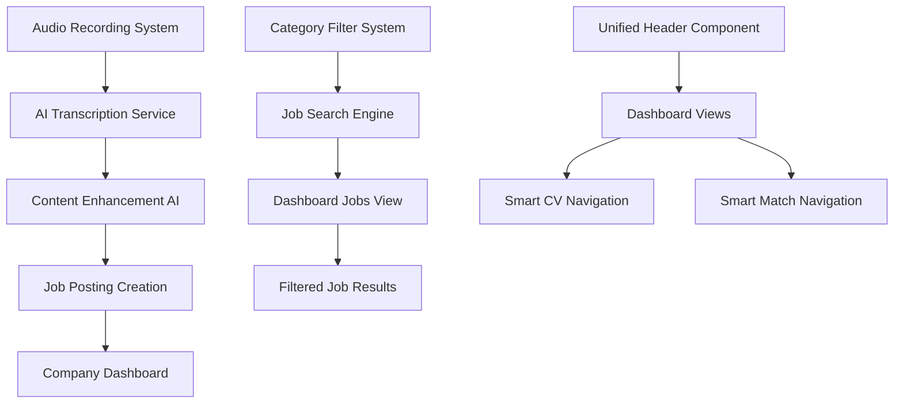

# Dashboard Enhancements Design Document

## Overview

This design document outlines the implementation of three key enhancements to the RouteJob dashboard system: unified header consistency across candidate views, AI-powered audio transcription for job posting creation, and enhanced category filtering in the jobs dashboard. The solution focuses on improving user experience through consistent design, leveraging modern AI capabilities for content creation, and providing efficient job discovery mechanisms.

## Architecture

### System Components



### Data Flow Architecture

1. **Header Navigation Flow**: Unified header → Route detection → Active page highlighting → Navigation actions
2. **Audio Transcription Flow**: Audio recording → Speech-to-text API → AI enhancement → Editable content → Job posting
3. **Category Filtering Flow**: Category selection → Filter application → Database query → Real-time results update

## Components and Interfaces

### 1. Enhanced Unified Header Component

**Location**: `frontend/app/components/UnifiedHeader.tsx`

**Props Interface**:
```typescript
interface UnifiedHeaderProps {
  currentPage: 'dashboard' | 'jobs' | 'map' | 'profile' | 'smart-profile';
  user: User | null;
  showSmartFeatures?: boolean;
  onNavigate?: (path: string) => void;
}
```

**Key Features**:
- Consistent typography matching homepage design
- Smart CV and Smart Match feature highlighting
- Responsive navigation with mobile menu
- Active page indication
- User authentication state management

### 2. Audio Recording and Transcription System

**Components**:
- `AudioRecorder.tsx` - Recording interface component
- `TranscriptionProcessor.tsx` - AI transcription handler
- `ContentEnhancer.tsx` - AI content improvement interface

**Audio Recorder Interface**:
```typescript
interface AudioRecorderProps {
  onRecordingComplete: (audioBlob: Blob, transcription: string) => void;
  onError: (error: string) => void;
  placeholder?: string;
  maxDuration?: number;
}
```

**Transcription Service Interface**:
```typescript
interface TranscriptionService {
  transcribeAudio(audioBlob: Blob): Promise<string>;
  enhanceContent(text: string, context: 'job-description' | 'requirements'): Promise<string>;
  validateContent(text: string): Promise<ValidationResult>;
}
```

### 3. Enhanced Category Filtering System

**Component**: `EnhancedCategoryFilter.tsx`

**Interface**:
```typescript
interface EnhancedCategoryFilterProps {
  selectedCategories: string[];
  onCategoriesChange: (categoryIds: string[]) => void;
  onFilterApply: (filters: CategoryFilter) => void;
  showJobCount?: boolean;
  enableRealTimeFiltering?: boolean;
}

interface CategoryFilter {
  categoryIds: string[];
  includeSubcategories: boolean;
  activeOnly: boolean;
}
```

## Data Models

### Audio Recording Data Model

```typescript
interface AudioRecording {
  id: string;
  jobPostingId: string;
  audioUrl: string;
  transcription: string;
  enhancedContent?: string;
  duration: number;
  createdAt: Date;
  processedAt?: Date;
  status: 'recording' | 'transcribing' | 'enhancing' | 'completed' | 'failed';
}
```

### Enhanced Job Posting Model

```typescript
interface EnhancedJobPosting {
  id: string;
  title: string;
  description: string;
  originalAudio?: AudioRecording;
  categories: string[];
  requirements: string[];
  salaryRange?: {
    min: number;
    max: number;
  };
  workType: 'full-time' | 'part-time' | 'contract' | 'freelance';
  location: {
    branchId: string;
    remote: boolean;
  };
  aiEnhanced: boolean;
  createdAt: Date;
  updatedAt: Date;
}
```

### Category Filter State Model

```typescript
interface CategoryFilterState {
  selectedCategories: string[];
  appliedFilters: CategoryFilter;
  filteredJobs: JobPosting[];
  totalCount: number;
  loading: boolean;
  error?: string;
}
```

## Correctness Properties

*A property is a characteristic or behavior that should hold true across all valid executions of a system-essentially, a formal statement about what the system should do. Properties serve as the bridge between human-readable specifications and machine-verifiable correctness guarantees.*

### Property 1: Header Consistency Preservation
*For any* dashboard page navigation, the unified header should maintain consistent styling and functionality across all views
**Validates: Requirements 1.1, 1.2, 1.3**

### Property 2: Audio Transcription Accuracy
*For any* audio recording input, the transcription system should produce text that preserves the semantic meaning of the original audio
**Validates: Requirements 2.2, 2.4**

### Property 3: Category Filter Completeness
*For any* selected category set, the filtering system should return all and only the job postings that belong to those categories or their subcategories
**Validates: Requirements 3.1, 3.2**

### Property 4: Real-time Filter Responsiveness
*For any* category selection change, the job list should update within the specified performance threshold without data loss
**Validates: Requirements 3.4, 6.1**

### Property 5: Audio-Text Content Consistency
*For any* job posting created with audio input, the final text content should accurately represent the original audio intent while maintaining professional quality
**Validates: Requirements 2.4, 7.1, 7.2**

### Property 6: Navigation State Preservation
*For any* header navigation action, the system should correctly highlight the active page and maintain navigation state consistency
**Validates: Requirements 1.4, 5.4**

### Property 7: Filter Performance Scalability
*For any* job dataset size up to the specified limit, category filtering operations should complete within performance requirements
**Validates: Requirements 6.1, 6.2**

## Error Handling

### Audio Recording Error Scenarios
1. **Microphone Access Denied**: Graceful fallback to text input with user notification
2. **Recording Timeout**: Auto-save partial recording and allow continuation
3. **Transcription Service Failure**: Preserve audio file and offer manual transcription
4. **AI Enhancement Failure**: Maintain original transcription with manual editing options

### Category Filtering Error Scenarios
1. **Network Connectivity Issues**: Use cached category data and offline filtering
2. **Large Dataset Performance**: Implement pagination and progressive loading
3. **Invalid Category Selection**: Validate selections and provide user feedback
4. **Filter State Corruption**: Reset to default state with user notification

### Header Navigation Error Scenarios
1. **Route Resolution Failure**: Fallback to dashboard home with error logging
2. **Authentication State Loss**: Redirect to login with return path preservation
3. **Component Rendering Error**: Display minimal header with core navigation

## Testing Strategy

### Unit Testing Approach
- **Header Component**: Test navigation logic, active state management, and responsive behavior
- **Audio Recorder**: Test recording functionality, error handling, and state management
- **Category Filter**: Test filter logic, performance with large datasets, and state updates
- **Transcription Service**: Mock AI services and test error handling and fallback mechanisms

### Property-Based Testing Requirements
- Use **React Testing Library** and **Jest** for component testing
- Use **MSW (Mock Service Worker)** for API mocking
- Configure property-based tests to run minimum 100 iterations
- Each property-based test must reference the corresponding design document property
- Tag format: `**Dashboard Enhancements, Property {number}: {property_text}**`

### Integration Testing
- **End-to-End Navigation**: Test header navigation across all dashboard views
- **Audio-to-Job-Posting Flow**: Test complete audio recording to job posting creation
- **Category Filter Integration**: Test filtering with real job data and category hierarchies
- **Performance Testing**: Validate filtering performance with large job datasets

### Accessibility Testing
- **Keyboard Navigation**: Ensure all header navigation is keyboard accessible
- **Screen Reader Support**: Test audio recording interface with screen readers
- **Color Contrast**: Validate header and filter components meet WCAG guidelines
- **Focus Management**: Test focus handling during navigation and filtering operations

## Implementation Notes

### Technology Stack
- **Frontend**: React 18+ with TypeScript, Next.js App Router
- **Audio Processing**: Web Audio API with MediaRecorder
- **AI Services**: Integration with OpenAI API or similar for transcription and enhancement
- **State Management**: React hooks with Context API for complex state
- **Styling**: Tailwind CSS for consistent design system

### Performance Considerations
- **Header Rendering**: Memoize header component to prevent unnecessary re-renders
- **Audio Processing**: Use Web Workers for audio processing to avoid UI blocking
- **Category Filtering**: Implement debounced filtering and virtual scrolling for large lists
- **Caching Strategy**: Cache category data and frequently accessed job listings

### Security Considerations
- **Audio Data**: Encrypt audio files in transit and at rest
- **AI API Keys**: Secure API key management with environment variables
- **User Authentication**: Validate user permissions for job posting creation
- **Input Validation**: Sanitize all transcribed and enhanced content before storage

### Deployment Strategy
- **Feature Flags**: Use feature flags for gradual rollout of audio recording functionality
- **A/B Testing**: Test header design variations and category filter interfaces
- **Monitoring**: Implement analytics for audio transcription success rates and filter usage
- **Rollback Plan**: Maintain ability to disable audio features and revert to text-only input