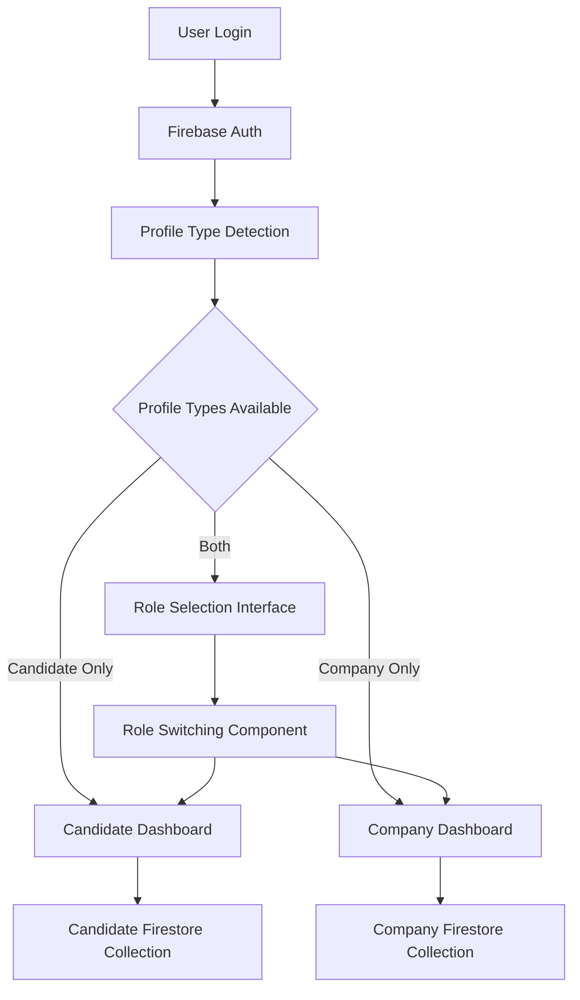
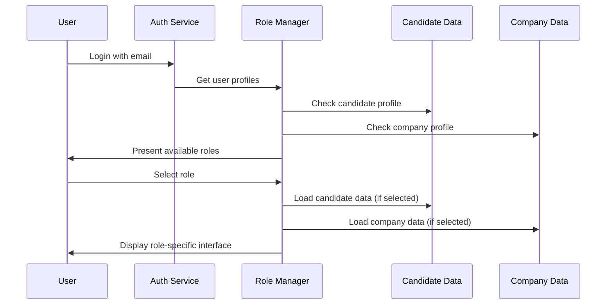

# Unified Email System Design Document

## Overview

The Unified Email System enables users to maintain both candidate and company profiles under a single email address and Firebase Authentication account. This design eliminates the need for multiple email addresses while maintaining clear separation between candidate and company data and functionality.

The system introduces a role-based approach where users can switch between candidate and company contexts seamlessly, with each role having its own dedicated data storage, user interface, and business logic.

## Architecture

### High-Level Architecture



### Data Flow Architecture



## Components and Interfaces

### 1. Authentication Service Enhancement

**Purpose**: Extend existing authentication to support unified email accounts

**Key Methods**:
- `checkUserProfiles(userId: string): Promise<ProfileTypes>`
- `linkProfileToUser(userId: string, profileType: 'candidate' | 'company', profileData: any): Promise<void>`
- `validateAccountOwnership(email: string, password: string): Promise<boolean>`

### 2. Role Manager Component

**Purpose**: Handle role switching and profile type management

**Key Methods**:
- `getCurrentRole(): 'candidate' | 'company' | null`
- `switchRole(newRole: 'candidate' | 'company'): Promise<void>`
- `getAvailableRoles(userId: string): Promise<string[]>`
- `setDefaultRole(userId: string, role: string): Promise<void>`

### 3. Profile Service Layer

**Purpose**: Manage separate candidate and company profile data

**Key Methods**:
- `createCandidateProfile(userId: string, data: CandidateProfile): Promise<void>`
- `createCompanyProfile(userId: string, data: CompanyProfile): Promise<void>`
- `getCandidateProfile(userId: string): Promise<CandidateProfile | null>`
- `getCompanyProfile(userId: string): Promise<CompanyProfile | null>`
- `updateProfile(userId: string, profileType: string, data: any): Promise<void>`
- `deleteProfile(userId: string, profileType: string): Promise<void>`

### 4. Role Switching UI Component

**Purpose**: Provide user interface for role selection and switching

**Props**:
- `availableRoles: string[]`
- `currentRole: string`
- `onRoleChange: (newRole: string) => void`

## Data Models

### User Account Structure

```typescript
interface UnifiedUserAccount {
  uid: string; // Firebase Auth UID
  email: string;
  createdAt: Timestamp;
  lastLoginAt: Timestamp;
  profileTypes: ('candidate' | 'company')[];
  defaultRole?: 'candidate' | 'company';
  preferences: {
    lastUsedRole?: 'candidate' | 'company';
    roleSelectionPreference: 'ask' | 'remember';
  };
}
```

### Candidate Profile Structure

```typescript
interface CandidateProfile {
  userId: string; // Reference to Firebase Auth UID
  personalInfo: {
    firstName: string;
    lastName: string;
    phone?: string;
    location?: string;
  };
  professionalInfo: {
    title?: string;
    experience?: string;
    skills: string[];
    resume?: string;
  };
  preferences: {
    jobTypes: string[];
    locations: string[];
    salaryRange?: {
      min: number;
      max: number;
    };
  };
  applications: string[]; // References to job applications
  createdAt: Timestamp;
  updatedAt: Timestamp;
}
```

### Company Profile Structure

```typescript
interface CompanyProfile {
  userId: string; // Reference to Firebase Auth UID
  companyInfo: {
    name: string;
    description?: string;
    industry?: string;
    size?: string;
    website?: string;
    logo?: string;
  };
  contactInfo: {
    contactPerson: string;
    phone?: string;
    address?: string;
  };
  jobPostings: string[]; // References to job postings
  createdAt: Timestamp;
  updatedAt: Timestamp;
}
```

### Firestore Collections Structure

```
users/{userId} - UnifiedUserAccount
candidates/{userId} - CandidateProfile
companies/{userId} - CompanyProfile
```

## Correctness Properties

*A property is a characteristic or behavior that should hold true across all valid executions of a system-essentially, a formal statement about what the system should do. Properties serve as the bridge between human-readable specifications and machine-verifiable correctness guarantees.*

### Property Reflection

After analyzing all acceptance criteria, several properties can be consolidated to eliminate redundancy:
- Profile linking properties (1.2, 1.3) can be combined into a comprehensive bidirectional linking property
- Role switching UI properties (2.2, 2.3) can be unified into a general role-based UI management property  
- Routing properties (3.2, 3.3) can be consolidated into a profile-type-based routing property
- Data isolation properties (5.2, 5.3) can be combined into a context-appropriate data usage property

Property 1: Account creation supports multiple profiles
*For any* email address, creating a user account should result in a User_Account that can support both candidate and company profile types
**Validates: Requirements 1.1**

Property 2: Bidirectional profile linking
*For any* existing user account, attempting to add a new profile type (candidate or company) should link the new profile to the existing account after password verification
**Validates: Requirements 1.2, 1.3, 1.4**

Property 3: Profile data separation
*For any* user account with multiple profile types, modifications to one profile should not affect the data in the other profile
**Validates: Requirements 1.5**

Property 4: Role selector visibility
*For any* user with both candidate and company profiles, the application header should display a role selector interface
**Validates: Requirements 2.1**

Property 5: Role-based UI management
*For any* role selection (candidate or company), the system should load the appropriate dashboard and hide features specific to the other role
**Validates: Requirements 2.2, 2.3**

Property 6: Session preservation during role switching
*For any* role switch operation, the user's authentication session should be preserved without requiring re-authentication
**Validates: Requirements 2.4**

Property 7: UI consistency with active role
*For any* role selection, the user interface should update to reflect the currently active profile type
**Validates: Requirements 2.5**

Property 8: Profile type detection on login
*For any* user login, the system should check for and identify all profile types (candidate, company, or both) associated with the user account
**Validates: Requirements 3.1**

Property 9: Profile-type-based routing
*For any* user with only one profile type, the system should automatically direct them to the appropriate dashboard (candidate or company)
**Validates: Requirements 3.2, 3.3**

Property 10: Multi-profile user handling
*For any* user with both profile types, the system should either display a role selection interface or default to the last used role
**Validates: Requirements 3.4**

Property 11: No-profile user handling
*For any* user with no existing profiles, the system should prompt them to create their first profile type
**Validates: Requirements 3.5**

Property 12: Account settings organization
*For any* user accessing account settings, the interface should display separate management sections for candidate and company profiles
**Validates: Requirements 4.1**

Property 13: Independent profile creation
*For any* new profile type creation, the operation should add the profile to the existing user account without modifying other existing profiles
**Validates: Requirements 4.2**

Property 14: Profile update isolation
*For any* profile information update, only the selected profile type should be modified while other profiles remain unchanged
**Validates: Requirements 4.3**

Property 15: Selective profile deletion
*For any* profile deletion operation, only the specified profile should be removed while preserving other profiles and the user account
**Validates: Requirements 4.4**

Property 16: Account cleanup on last profile deletion
*For any* user deleting their final remaining profile, the system should offer the option to delete the entire user account
**Validates: Requirements 4.5**

Property 17: Separate document storage
*For any* profile data storage operation, candidate and company profiles should be maintained in separate Firestore documents linked by the user account ID
**Validates: Requirements 5.1**

Property 18: Context-appropriate data usage
*For any* user operation (job application, job posting), the system should use only data from the appropriate profile type and prevent cross-contamination from other profile types
**Validates: Requirements 5.2, 5.3**

Property 19: Role-based data display
*For any* user information display, only data relevant to the currently active profile type should be shown
**Validates: Requirements 5.4**

Property 20: Context-based operation validation
*For any* data operation, the system should validate that the action is appropriate for the current profile type context
**Validates: Requirements 5.5**

## Error Handling

### Authentication Errors
- **Invalid Password During Linking**: When password verification fails during profile linking, display clear error message and allow retry
- **Account Not Found**: When attempting to link to non-existent account, provide appropriate error feedback
- **Firebase Auth Failures**: Handle network issues, service unavailability, and quota exceeded scenarios

### Profile Management Errors
- **Profile Creation Failures**: Implement retry logic with exponential backoff for Firestore write failures
- **Profile Not Found**: Handle cases where expected profiles don't exist in Firestore
- **Data Corruption**: Validate profile data integrity and provide recovery mechanisms

### Role Switching Errors
- **Invalid Role Selection**: Prevent switching to roles that don't exist for the user
- **Session Timeout**: Handle authentication expiration during role switching
- **UI State Inconsistency**: Implement state recovery mechanisms for UI synchronization issues

### Data Consistency Errors
- **Cross-Profile Data Leakage**: Implement validation to prevent data from one profile affecting another
- **Orphaned Profiles**: Handle cases where profiles exist without corresponding user accounts
- **Concurrent Modifications**: Implement optimistic locking to handle simultaneous profile updates

## Testing Strategy

### Dual Testing Approach

The testing strategy employs both unit testing and property-based testing to ensure comprehensive coverage:

**Unit Testing**:
- Specific examples demonstrating correct behavior for each component
- Edge cases such as empty profiles, network failures, and invalid inputs
- Integration points between authentication, profile management, and UI components
- Error conditions and recovery scenarios

**Property-Based Testing**:
- Universal properties that should hold across all valid inputs using **fast-check** library
- Each property-based test configured to run a minimum of 100 iterations
- Tests tagged with comments referencing design document properties using format: **Feature: unified-email-system, Property {number}: {property_text}**
- Each correctness property implemented by a single property-based test

**Testing Framework**: Jest with fast-check for property-based testing

**Key Testing Areas**:
1. **Authentication Flow Testing**: Verify account creation, profile linking, and password validation
2. **Role Management Testing**: Test role switching, UI updates, and session preservation  
3. **Data Isolation Testing**: Ensure profile data separation and context-appropriate operations
4. **UI Component Testing**: Validate role selector, dashboard routing, and interface consistency
5. **Error Handling Testing**: Test recovery mechanisms and error message clarity

**Property-Based Test Requirements**:
- Each property-based test must be tagged with: **Feature: unified-email-system, Property {number}: {property_text}**
- Tests must validate universal properties across randomly generated inputs
- Minimum 100 iterations per property test to ensure statistical confidence
- Smart generators that constrain inputs to valid system states